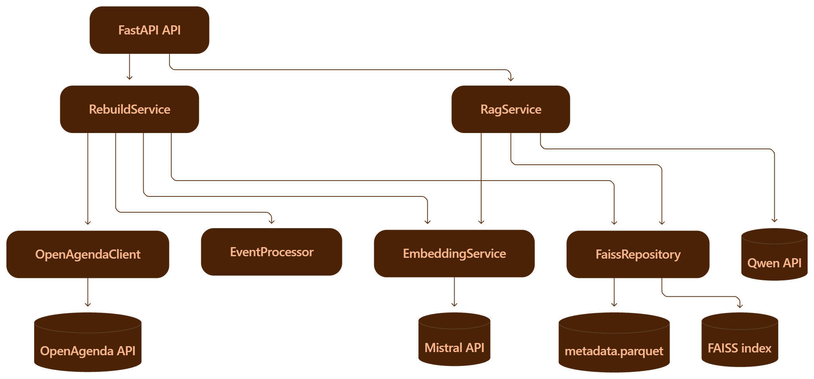

Projet Puls-Events

# Objectif
Créer un Chatbot intelligent capable de répondre aux utilisateurs à propos des évenements culturels à venir. Il devra s'appuyer sur un RAG (Retrieval Augmented Generation).

# Structure du projet
exploration : contient les notebook d'étude de la solution
data : contient les fichiers sources, les index Faiss, les métadonnées et le fichier test_cases de vérification des tests Ragas.
scripts : un script de création de l'index de la base Faiss. Les embeddings de évènements et les métadonnées sont liés par un faiss_id.
src : l'api et les services liés
src/services : les services de récupération des données sources, leur traitement, l'enregistrement en base vectorielle. Il contient également le service d'orchestration qui appelle Mistral pour la génération des chunks et des embeddings, l'appel au tool qui intérroge la base Faiss pour récupérer les évènements culturels ou Mistral Chat (ou Qwen3.8) pour générer des réponses et répondre si besoin en dehors du périmètre de ces évènements. Il contient enfin le service de rebuild de la base permettant de récupérer les derniers évènements.
tests : regroupe les tests unitaires, les tests Ragas, les tests d'API et certains appels aux LLM.

Enfin il existe un fichier .env avec les clés, et des fichiers docker-compose et Dockerfile pour gérer le container permettant de faire tourner le service en local ou sur un serveur après déploiement.

# Tests
========================================================================= tests coverage =====================================
_________________________________________________________ coverage: platform win32, python 3.11.9-final-0 ____________________

Name                               Stmts   Miss  Cover   Missing
----------------------------------------------------------------
src\__init__.py                        0      0   100%
src\api.py                            63     63     0%   1-199
src\services\EmbeddingService.py      20      0   100%
src\services\EventProcessor.py        77      8    90%   70, 98, 104, 123, 152, 158, 170, 177
src\services\FaissRepository.py       69      5    93%   75, 114, 153, 158, 179
src\services\OpenAgendaClient.py      52      1    98%   157
src\services\RAGService.py            63      0   100%
src\services\RebuildService.py        24      0   100%
src\services\__init__.py               0      0   100%
----------------------------------------------------------------
TOTAL                                368     77    79%

# Architecture du Chatbot

# Instructions de reproduction
Construction de l'index Faiss : 
Lancer le script de construction de l'index : `python -m scripts.build_index`

Lancement de l'API dans une image docker en local :
Lancer le moteur avec Docker Desktop
Lancer l'image docker : `docker compose build`
Activer le service : `docker compose up`

Lancer l'api en local : `uvicorn src.api:app --reload`
Swagger : http://127.0.0.1:8000/docs

# Optimisations
Optimisation des paramètres du modèle : le mode thinking a été désactivé pour limiter le temps de réponse. Ici il n'est pas nécessaire d'avoir un modèle de raisonnement très poussé.
Optimisation du volume de données envoyé au LLM pour la formulation de la réponse. Travail sur le compactage des dates.
On est passé à un format :
Du 12/06/2026 au 20/12/2026 ; créneaux récurrents : 13:00 - 19:00; 19:00 - 23:00

